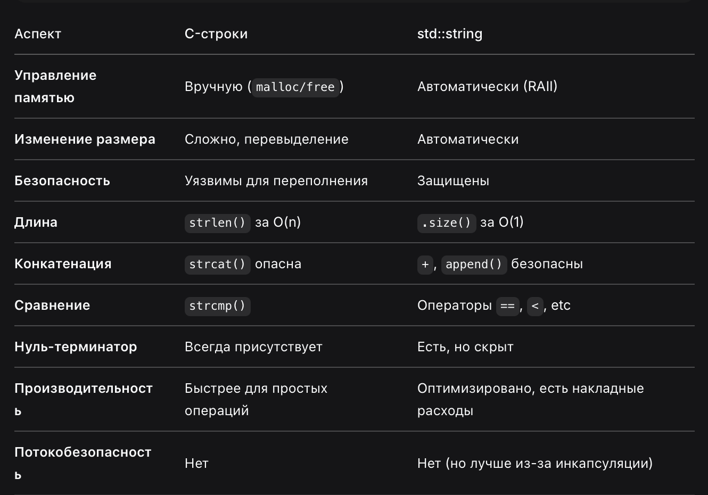

# ООП. Абстракция и Инкапсуляция
## абстракция 
- придание объекту характеристик, которые четко определяют его концептуальные границы, 
отличая от всех других объектов. Основная идея состоит в том, чтобы отделить способ использования составных объектов данных
от деталей их реализации в виде более простых объектов.

## инкапсуляция 
- связывает данные и методы работы с этими данными в единую логическую единицу, (сокрытие внутренних деталей реализации 
от внешнего мира). Класс объединяет данные и методы работы с этими данными. Данные мы прячем за реализацией

# Классы. Специальные методы
## класс
- универсальный, комплексный тип данных, состоящий из тематического единого набора "полей" и "методов"

## Специальные методы классов
### Constructor
- используется для инициализации объекта(обеспечивает инвариант)
- название совпадает с классом
- **виды конструкторов**
    - **default constructor** (без аргументов)
    - **parameterized constructor** (принимает аргументы, инициализирующие поля объекта)
    - **copy constructor** (создание нового объекта, копируя из сущ. объекта)
    - **move constructor** (Позволяет перемещать ресурсы из одного объекта в другой, что более эффективно, чем копирование.)

### Rule of three
- если определен хотя бы один из трех методов, надо и остальные тоже определить
1) Destructor
2) Copy constructor
3) Copy assignment operator

Правило пяти добавляет Move конструктор и Move assignment operator

### Диструктор
- Вызывается при уничтожении объекта для освобождения ресурсов (например, памяти). Если вы не определили свой деструктор, компилятор предоставит неявно сгенерированный деструктор по умолчанию.

```cpp
~имя_класса() 
{
    // код деструктора
}
```

Классы. Перегрузки операторов
# Перегрузка операторов
1. **не должна противоречить здравой логике**
2. как член класса или как глобальная функция
3. [],(),->,= можно перегружать только как члены класса
4. ввод(>>) и вывод(<<) всегда глобальные функции
5. операторы **::** , **(.*)** (доступ к члену-указателю по указателю) , **.** (доступ к члену класса) , **?:**, **sizeof** перегружать нельзя
6. новые операторы делать нельзя (на уровне компиляции зафиксировано)

```cpp
Point operator+(const Point& other) const {
    return Point(x + other.x, y + other.y);
}
```

ООП. Наследование
- позволяет написать новый класс на основе уже существующего с частично или полностью заимствующей функциональностью. Класс, от которого производится наследование, называется базовым, родительским или суперклассом. Новый класс - потомком, наследником, дочерним или производным классом.

- полиморфизм подтипов, **is-a relationship**

- обеспечивает повторное использование кода (следствие но не причина)

- наследование может быть множественным

### Порядок вызова конструкторов:
- базовый класс
- дочерний класс
### Порядок вызова деструкторов:
- дочерний класс
- базовый класс

### Наследник
- хранит в себе родителя
- сохраняет методы родителя*
- приведение к базовому классу **(slicing)**
- модификаторы доступа

### модификатор доступа к полям базового класса
```cpp
class CStudent : public CPerson{}
```

- регулирует доступ к деталям реализации базового класса

ключевое слово **protected** - позволяет получить доступ к скрытым полям базового класса, но скрывает извне. 
то есть извне не можем обращаться, но из классов-наследников можно

### Множественное наследование
- класс наследует поля и методы n-количества классов

### Diamond Problem
если в двух базовых классах, есть одинаковые поля (допустим два имени),то будет ошибка компиляции
(компилятор не понимает, что надо подставить)
Решение: явно указать, метод какого класса надо использовать

### Проблема множественного наследования
- надо либо явно указать метод того класса, который нужен или поставить по умолчанию (using)

### final
- можно явно запретить наследование, класс не может быть теперь базовым
```cpp
class CPerson final{}
```

ООП. Полиморфизм
## Полиморфизм
- это свойство системы, позволяющее использовать объекты с одинаковым интерфейсом без информации о типе и внутренней структуре объекта.
### Динамический полиморфизм
- позднее и раннее связывание
- виртуальные функции

```cpp
class ConsoleLogger{
    public:
        void Log(const char& message){
            std::cout << message << std::endl;
        }
        virtual ~ILogger() = default;
};

class CConsoleLogger : public Ilogger{
public:
    void Log(const char* message) override{
        std::cout << message << std::endl;
    }
}
```
# Виртуальные функции
Производные классы могут переопределять виртуальные функции, предоставляя свою реализацию. Для явного указания используется override (начиная с C++11).
Динамическое связывание (Позднее связывание): Выбор конкретной версии функции для вызова происходит в момент выполнения программы, основываясь на фактическом типе объекта, а не на типе указателя/ссылки.

### Таблица виртуальных функций
- таблица заводится для любого класса с виртуальной функцией
- вызов виртуального метода - это вызов метода по адресу из таблицы
- стандарт не определяет механизм реализации виртуальных функций, однако большинство компиляторов реализуют именно таблицу виртуальных функций

## Абстрактный класс
- класс, экземпляр которого нельзя создать
- обычно используется в качестве базового класса
- содержит хотя бы одну чисто виртуальную ф-ию
### Чисто виртуальная функция
Объявляются как virtual <тип> <имя функции>() = 0;. Не имеют реализации в базовом классе и делают класс абстрактным, обязывая наследников их реализовать, как в интерфейсе.

Отсутствие реализации возможно с помощью записи для определения метода:
```cpp
<signature> = 0;
```

### Стоимость виртуальных функций
- лишнее обращение к таблице вместо явного адреса
- невозможно сделать inline optimization
- для колекций объектов - они всегда в куче
- порядок объектов также может влиять на скорость

# RAII - resource acquisition is initialization (захват ресурса - есть инициализация)
- обеспечивает инкапсуляцию ресурса и инвариант состаяния
- безопасна к исключениям для объектов лежащих на стеке
- применяется для указателей, мьютексов, файлов...

RAII — это парадигма, где:

Получение ресурса происходит в конструкторе объекта
Освобождение ресурса происходит в деструкторе объекта
Ресурс гарантированно освобождается при выходе объекта из области видимости

```cpp
// БЕЗ RAII - опасный подход
void risky_function() {
    FILE* file = fopen("data.txt", "r");
    if (!file) return;  // Если здесь return - утечка!
        
    if (error) return;  // Если здесь ошибка - утечка!
    
    fclose(file);  // Должны не забыть закрыть
}

class FileRAII {
private:
    FILE* file_;
    
public:
    // Приобретение ресурса в конструкторе
    FileRAII(const char* filename, const char* mode) 
        : file_(fopen(filename, mode)) {
        if (!file_) throw std::runtime_error("Cannot open file");
    }
    
    // Освобождение ресурса в деструкторе
    ~FileRAII() {
        if (file_) {
            fclose(file_);
            std::cout << "File closed automatically\n";
        }
    }
    
    // Запрещаем копирование (опционально)
    FileRAII(const FileRAII&) = delete;
    FileRAII& operator=(const FileRAII&) = delete;
    
    // Методы для работы с ресурсом
    FILE* get() { return file_; }
};
```

# Разное
- Ключевое слово **explicit** в C++ используется для предотвращения неявных преобразований типов конструкторами или операторами преобразования, заставляя компилятор выполнять только явное приведение типов. Это повышает безопасность кода, делая его более предсказуемым, и применяется к конструкторам с одним параметром и операторам преобразования, чтобы заблокировать автоматическое создание объекта из другого типа, когда это нежелательно, как, например, MyClass obj = 10; (вместо MyClass obj(10);). 

# vector (класс)
- принадлежит библиотеке шаблонов stl
- прокаченный дин массив сам следит за выделением памяти, скорость та же, легкое добавление элемента в начало, конец, середину
- при обращении по нес. индексом либо мусор, либо ошибка

## методы
**push_back** - добавление в конец массива
**size** - кол-во элементов
**at** - получить доступ к i-элементу без риска выйти за границу вектора, однако он медленее, чем оператор **[]**
**clear** - очистить от всех элементов
**pop_back** - удалить последний элемент
**capacity** - возвращает вместимость вектора
**reserve(n,x)** - сколько должна быть вместимость, чем заполнить
**shrink_to_fit()** - выравнивает capacity по size
**empty()** - true/false есть ли элементы в векторе
**resize(n,x)** - изменить вместимость, чем заполнить
**insert()** - вставка элемента в вектор в любое место !работает через итератор
**erase()** - стереть i-элемент !работает через итератор
**begin** - возвращает итератор,указывающий на первый элемент вектора
**end()** - указывает на область в памяти сразу после последнего элемента массив
**cbegin** и **cend** - те же самые, только возвращают константные значения

## добавление элемента:
вместимость увеличивается не на 1, а на несколько (в основном на 2)

# итераторы
- итераторы для каждого контейнера разные

```cpp
vector<int> myVector;
vector<int>::iterator it;
it = myVector.begin(); // указывает на первый эл вектора

std::cout << *it << std::endl; // выведет первый элемент вектора
```

# string
std::string — это класс в стандартной библиотеке C++, представляющий собой динамическую строку переменной длины с автоматическим управлением памятью. Это не просто обертка над char*, а сложная, оптимизированная структура.

```cpp
class basic_string {
private:
    // Три возможных состояния:
    struct SmallBuffer {
        char data[15];          // Для коротких строк (SSO)
        unsigned char size : 7; // Битовое поле для размера
        unsigned char is_small : 1; // Флаг маленькой строки
    };
    
    struct LargeBuffer {
        char* data;             // Указатель на кучу
        size_t size;            // Текущий размер
        size_t capacity;        // Выделенная память
    };
    
    union {
        SmallBuffer small;      // Если строка короткая
        LargeBuffer large;      // Если строка длинная
    };
};
```
При передаче в C-функции (использовать c_str())




# move
copy — создание точной независимой копии объекта:
move — передача ресурсов одного объекта другому:
```cpp
std::string a = "Hello";
std::string b = std::move(a);  // Перемещение: ресурсы передаются b
// a = "" (пустая, в валидном но неуказанном состоянии)
// b = "Hello" - ОДИН набор ресурс
```

std::move не перемещает сам по себе! Он только:

Преобразует lvalue в rvalue ссылку (The move assignment operator is a special member function that takes an rvalue reference (&&) to an object of the same class type as its parameter. )
Дает "разрешение" на перемещение
Фактическое перемещение происходит в конструкторе/операторе
std::move — это только cast, не операция перемещения
Перемещение передает владение ресурсами

# unique_ptr
std::unique_ptr — это умный указатель, который:
- Исключительно владеет объектом (не может быть копий)
- Автоматически удаляет объект при выходе из области видимости
- Гарантирует отсутствие утечек памяти (RAII)
- Имеет нулевые накладные расходы (как обычный указатель)
- Нельзя копировать (unique_ptr(const unique_ptr&) = delete)
- Можно перемещать (unique_ptr(unique_ptr&&))

# unordered_map и map
Сравнение в двух словах

-----------------------------------------------------------------------------------------------------------------
Характеристика	       std::unordered_map	                    std::map
-----------------------------------------------------------------------------------------------------------------
Реализация	           Хэш-таблица	                            Красно-черное дерево
-----------------------------------------------------------------------------------------------------------------
Сложность	           O(1) в среднем, O(n) в худшем	        O(log n) гарантировано
-----------------------------------------------------------------------------------------------------------------
Порядок элементов	   Не упорядочен	                        Упорядочен по ключу
-----------------------------------------------------------------------------------------------------------------
Требования к ключу	   Должен быть хэшируемым (hash<K>)	        Должен быть сравнимым (operator< или компаратор)
-----------------------------------------------------------------------------------------------------------------
Память	               Больше (хэш-таблица + коллизии)	        Меньше (только узлы дерева)
-----------------------------------------------------------------------------------------------------------------
Итераторы	           Инвалидируются при рехэше	            Стабильны (кроме удаляемого)